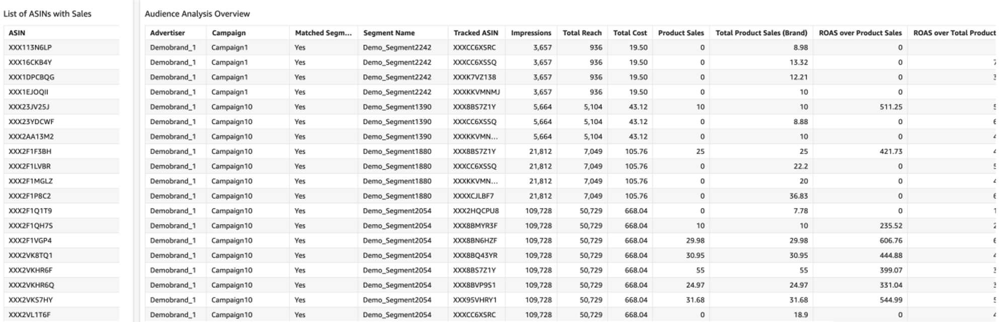

// Add steps as necessary for accessing the software, post-configuration, and testing. Don’t include full usage instructions for your software, but add links to your product documentation for that information.
//Should any sections not be applicable, remove them

== Test the deployment
// If steps are required to test the deployment, add them here. If not, remove the heading
* Monitor the link:https://console.aws.amazon.com/cloudformation/home?region=us-east-1[AWS CloudFormation], link:https://console.aws.amazon.com/codesuite/codebuild/projects?region=us-east-1[AWS CodeBuild] and link:https://console.aws.amazon.com/codesuite/codepipeline/pipelines?region=us-east-1[AWS CodePipeline] in us-east-1 region and should not have any errors or failures. It will take approximate 90 minutes.

* Once finished go to link:https://console.aws.amazon.com/athena/home?region=us-east-1[Amazon Athena] link:https://docs.aws.amazon.com/IAM/latest/UserGuide/id_roles_use_switch-role-console.html[switch the role] on the top right to @-saw-datalake-users-, Ex. - @demoteam-saw-datalake-users-us-east-1. If using the default settings of the module, put the Account Id the same as the AWS Account Id being used. The Role name should be @demoteam-saw-datalake-users-us-east-1. Switch Amazon Athena workgroup to ---workgroup, EX - demoteam-demodl-dev-workgroup.

* Run the below queries to explore the sample AMC datasets

** SELECT * FROM "demoteam_amcdataset_dev_stage"."testdemocustomer_audience_analysis_adhoc" limit 10;
** SELECT * FROM "demoteam_amcdataset_dev_stage"."testdemocustomer_device_exposure_adhoc" limit 10;
** SELECT * FROM "demoteam_amcdataset_dev_stage"."testdemocustomer_frequency_distribution_adhoc" limit 10;
** SELECT * FROM "demoteam_amcdataset_dev_stage"."testdemocustomer_geo_analysis_adhoc" limit 10;
** SELECT * FROM "demoteam_amcdataset_dev_stage"."testdemocustomer_product_mix_adhoc" limit 10;

== Post-deployment steps
// If post-deployment steps are required, add them here. If not, remove the heading

.Below are some sample QuickSight Dashboards built using the sample AMC datasets:
For more detailed configuration steps of the QuickSight dashboards, review the document located link:../docs/AMC_Analytics_Delivery_Kit-Quicksight_Instructions.pdf[QuickStart Dashboard Setup Guide]

* Audience Analysis
** This dashboard provides analysis on audience segments targeted by the customer and also details of audience segments that user was a part of but not targeted for purchases of customer products on Amazon.
* Frequency Distribution
** This dashboard provides analysis on performance and delivery by different frequencies/impression exposures to help optimize campaign frequency caps to maximize conversion likelihood for purchases of assigned customer products on Amazon.
* Device Exposure
** This dashboard helps to determine performance metrics (i.e., ROAS, Impressions, Conversions, Clicks) across device types (e.g., TV, Mobile, PC, Tablet) for purchases of assigned customer products on Amazon.
* Geo Analysis
** This dashboard provides analysis on performance data by geographic location (e.g.DMA) for purchases of assigned customer products on Amazon.
* Product Mix Analysis
** This dashboard provides performance data of users exposed to both sponsored products (SP) and display campaigns (DSP) and KPIs surrounding them.

== Building Your First QuickSight Dashboard with AMC Reports
The AMC Dashboard provides an interactive visualization of marketing performance insights with the ability to slice the data by campaign, device type, DMA, frequency, audience segments, and time periods.
The dashboard’s goal is to provide a plethora of event level marketing insights in one visualized central location. The dashboard draws from a series of custom workflows built upon Demo Customer data available in AMC that are run on a daily basis. It has a text visual that describes how to read and understand the dashboard
The users can get read only permissions to this dashboard and can view relevant data visuals.
The dashboard shows metrics both numerically (in tabular form) and graphically (bar charts, stacked bar combo charts, maps, etc.) to enable quick insight discovery. This data can be exported into csv files for further analysis.

=== Initial Setup
You will need author access to a QuickSight Account to get started with building your first dashboard. If you don't have a QuickSight account already, below are the steps to create one.

1. Launch the **AWS Console** (https://console.aws.amazon.com) in a new browser tab, search for **QuickSight** and launch it.
2. On the **QuickSight** page, click **Sign up for QuickSight** button.
3. Keep the default **Enterprise** edition, scroll down and click the **Continue** button.
4. Enter a **QuickSight account name** & **Notification email address**. Enter your official email as the notification email.
5. Scroll down and click the **Finish** button. (It can take 15-30 Secs to set up the account)
6. Click the **Go to Amazon QuickSight** button. You will now be taken to QuickSight console.

=== Authorize connection through AWS Lake Formation
Insert Steps to Get Signed up for QuickSight
https://aws.amazon.com/blogs/big-data/securely-analyze-your-data-with-aws-lake-formation-and-amazon-quicksight/

=== Query & Visualize Your First AMC Use Case 
Amazon Marketing Cloud (AMC) enables advertisers to query event level data within a privacy friendly environment, Amazon QuickSight offers users a cloud-powered business analytics service to build visualizations, perform ad-hoc analysis, and quickly get business insights from their data. 

The dashboard images were designed keeping in mind 5 most commonly used advertising use cases that highlight the applications of using AMC’s event level data. The use case highlighted in the dashboard are as below:

#### Time to Conversion

Find out how long it takes for your customers to convert after last seeing your ad. It is important to understand how long it takes customers who see your ad to complete the conversion, and how that impacts the data you see in your conversion report. Sometimes the conversions happens rapidly, within a few minutes. Other times it might take days for your customers to complete the purchase. You can use this information to adjust the duration of campaign and promotion to maximize sales. In our amazon_attributed_events_by_conversion_time and amazon_attributed_events_by_traffic_time tables, we report up to 14 days after the customers’ last exposure to your ad.

#### Key Performance Indicators (KPIs):

|===
| KPI | Definition 

| Time to Conversion
| The amount of time customers take from last seeing your ad to purchase. The time has been converted to minutes, hours and days from seconds in the query template. You may adjust it based on your use case.

| Purchases
| The number of times any amount of a promoted product or products are included in a purchase event. Purchase events include video rentals and new Subscribe & Save subscriptions. Sum of purchases from users_that_purchased.

| Total Brand Purchases
| The number of times any number of products are included in a single purchase event. Purchase events include Subscribe & Save subscriptions and video rentals. This counts purchases for promoted products as well as products from the same brands as the products tracked in the order. (Total purchases = Purchases + Purchases Brand Halo)
|===

## Business Outcomes:
This section provides potential business outcomes derived from the Audience analysis use case:
1) Investigating performance of untargeted audiences helps to discover audience segments that can be added to
current targeted due to their potential positive impact on performance or scale.

2) Additionally, we can discover more insights into the attributes of our targeted audiences by seeing what other
untargeted audience segments show strong performance – learning more about our most valued users or audiences to best
target for potential new customers. This can be used for building better customer profiles, new creative messaging,
campaign construction, etc.

## Visual Details:
This section provides details on the QuickSight dashboard visuals for the Audience Analysis use case.

Query used for the visual: <<INSERT-LINK-TO-SQL>>

### Table View:
This visual provides an overview of all audience segments per campaign and ASIN
Each audience can be analyzed separately by clicking audience segment from controls and it can be further
analyzed per product by clicking on the List of ASINs table on the left

//== Best practices for using {partner-product-short-name} on AWS
// Provide post-deployment best practices for using the technology on AWS, including considerations such as migrating data, backups, ensuring high performance, high availability, etc. Link to software documentation for detailed information.

//_Add any best practices for using the software._

//== Security
// Provide post-deployment best practices for using the technology on AWS, including considerations such as migrating data, backups, ensuring high performance, high availability, etc. Link to software documentation for detailed information.

//_Add any security-related information._

//== Other useful information
//Provide any other information of interest to users, especially focusing on areas where AWS or cloud usage differs from on-premises usage.

//_Add any other details that will help the customer use the software on AWS._
