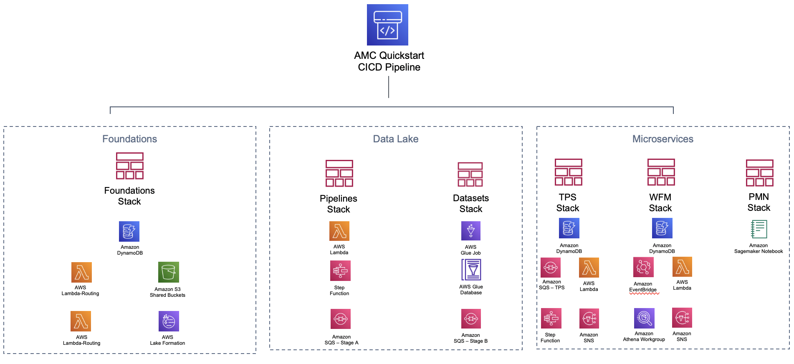

=== Confirm your AWS account configuration

. Sign in to your AWS account at https://aws.amazon.com[https://aws.amazon.com^] with an IAM user role that has the necessary permissions. For more information, see link:#_planning_the_deployment[Planning the deployment], earlier in this guide.
. Ensure that your AWS account is configured correctly, as discussed in the link:#_technical_requirements[Technical requirements] section.

// Optional based on Marketplace listing. Not to be edited
ifdef::marketplace_subscription[]
=== Subscribe to the {partner-product-short-name} AMI

This Quick Start requires a subscription to the AMI for {partner-product-short-name} in AWS Marketplace.

. Sign in to your AWS account.
. Open the page for the {marketplace_listing_url}[{partner-product-short-name} AMI in AWS Marketplace^], and then choose *Continue to Subscribe*.
. Review the terms and conditions for software usage, and then choose *Accept Terms*. +
  A confirmation page loads, and an email confirmation is sent to the account owner. For detailed subscription instructions, see the https://aws.amazon.com/marketplace/help/200799470[AWS Marketplace documentation^].

. When the subscription process is complete, exit out of AWS Marketplace without further action. *Do not* provision the software from AWS Marketplace—the Quick Start deploys the AMI for you.
endif::marketplace_subscription[]
// \Not to be edited

=== Launch the Quick Start
// Adapt the following warning to your Quick Start.
//WARNING: If you deploy {partner-product-short-name} into an existing VPC, ensure that your VPC has two private subnets in different Availability Zones for the workload instances and that the subnets are not shared. This Quick Start does not support https://docs.aws.amazon.com/vpc/latest/userguide/vpc-sharing.html[shared subnets^]. The subnets require https://docs.aws.amazon.com/vpc/latest/userguide/vpc-nat-gateway.html[NAT gateways^] in their route tables to allow the instances to download packages and software without exposing the instances to the internet. Also ensure that the domain name in the DHCP options is configured, as explained in http://docs.aws.amazon.com/AmazonVPC/latest/UserGuide/VPC_DHCP_Options.html[DHCP options sets^]. Provide your VPC settings when you launch the Quick Start.

Each deployment takes about {deployment_time} to complete.

+
. Check the AWS Region that's displayed in the upper-right corner of the navigation bar, and change it if necessary. This Region is where you build the infrastructure. The template is launched in the {default_deployment_region} Region by default. For more information, see link:#_supported_aws_regions[Supported AWS Regions], earlier in this guide.

Once the above steps are performed, run the deploy command to deploy the quickstart

```
$ ddk deploy --profile [AWS_PROFILE]
```

The deploy all step deploys an AWS CodePipeline along with its respective AWS CloudFormation Stacks. The last stage of each pipeline delivers the AMC Quickstart infrastructure respectively in the child (default dev) environment through CloudFormation.



_Foundations:_ This application creates the foundational resources for the quickstart. These resources include Lambda Layers, Glue Jobs, S3 Buckets, routing SQS Queues, and Amazon DynamoDB Tables for data and metadata storage.

_Data Lake:_ This application creates the resources for the data lake. All the resources needed for orchestration between services and data processing code are provisioned here.

_Microservices:_ This application creates the resources for the supporting Microservices. All the resources needed for orchestration between the microservices, data processing code, and data and metadata storage for the microservices are provisioned here.

For a walkthrough of the steps the AWS CodePipeline goes through to deploy these resources please refer to [here](#amc-quickstart-codepipeline-steps).


_NOTE:_ If deploying in a new AWS Account, the Assets stage of the CodePipeline may fail due to limitations for the number of concurrent file assets to publish. This is a current limitation of AWS CodeBuild. To fix, click the `Retry` button in CodePipeline for the Assets Stage. This will manually continue the Assets Stage to continue building file assets from its most current progress.
 

== Hydrating the Data Lake

To hydrate the data lake run the below shell script
```
$ make insert_tps_records
$ make create_workflows
```

_NOTE:_ Make sure the `ENV` variable in the `Makefile` is set to the correct environment name before proceeding to hydrate the data lake (default: `dev`)

For a more detailed description of the aforementioned commands, refer to below:

_Insert TPS Records:_ To initialize the process of onboarding your AMC instance on the Amazon AD Tech platform, this script adds client configurations to a TPS Customer Configuration table in Amazon DynamoDB. The configuration includes your AMC Endpoint URL, AMC Bucket Name and other related information on your AMC Instance. The Tenant Provisioning Service (TPS) will then automatically:

- Onboard clients using configuration which is persisted in a DynamoDB Table. It helps to reduce time to onboard new customers
- Provide functionality to automatically enable different modules (AMC/Sponsored ADs/DSP) during the onboarding process for each client
- Provide a centralized location to manage various clients and modules and supports multi-tenancy

_Create Workflows:_ To initialize the creation, scheduling and execution of AMC workflows, this script adds 4 default workflows to an AMC Workflows Library table in Amazon DynamoDB. From there Workflow Manager Service (WFM) will automatically create workflow schedules and add them to your AMC instance. WFM also allows you to:

- Automatically trigger the deployment of the SQS queues, IAM policies, workflows and workflow schedules in WFM for the customer's AMC instance upon adding or updating a customer record to the Tenant Provisioning Service (TPS)
- Synchronize workflows and workflow schedules in the Workflow Library service with multiple AMC Instances
- Send execution requests to an SQS queue rather than directly to the AMC endpoint to prevents timeout failures when there are large number of requests in a short period of time
- Scheduled with dynamic relative time windows rather than using AMC's scheduling feature which only allows predefined scheduled reporting such as Daily or Weekly
- Track the status of all workflow executions for customer AMC instances whether they are submitted through WFM or other means (postman, etc.). Having the status synced to DynamoDB allows events to be triggered or notifications to be sent when executions change state. This table can also be used to track historical executions for troubleshooting or performance monitoring.