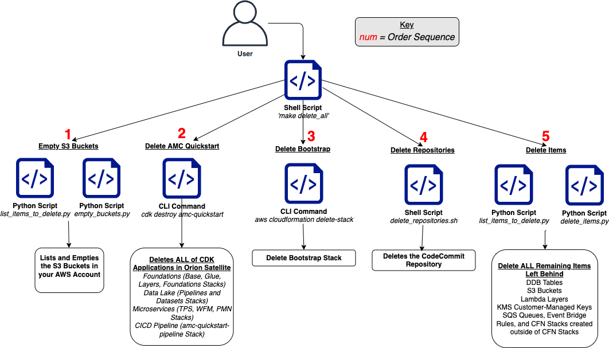

// Include any postdeployment steps here, such as steps necessary to test that the deployment was successful. If there are no postdeployment steps, leave this file empty.

== Postdeployment steps

* Run the below queries to explore the sample AMC datasets
```
   SELECT * FROM "demoteam_amcdataset_dev_stage"."testdemocustomer_audience_analysis_adhoc" limit 10;
   SELECT * FROM "demoteam_amcdataset_dev_stage"."testdemocustomer_device_exposure_adhoc" limit 10;
   SELECT * FROM "demoteam_amcdataset_dev_stage"."testdemocustomer_frequency_distribution_adhoc" limit 10;
   SELECT * FROM "demoteam_amcdataset_dev_stage"."testdemocustomer_geo_analysis_adhoc" limit 10;
   SELECT * FROM "demoteam_amcdataset_dev_stage"."testdemocustomer_product_mix_adhoc" limit 10;
```

== Cleaning Up the Quickstart

Once the solution has been deployed and tested, use the following command to clean up the resources

```
$ make delete_all
```
_NOTE:_ Before running this command, look into the  `Makefile` and ensure that:

 1. The `delete_repositories` function is passing the correct `-d AMC_QUICKSTART_REPO_NAME` (default: `ddk-amc-quickstart`)
 
 2. The `delete_bootstrap` function is passing the correct `--stack-name BOOTSTRAP_STACK_NAME` (default: `DdkDevBootstrap`)

This command will go through the following sequence of steps in order to clean up your AWS account environment:


